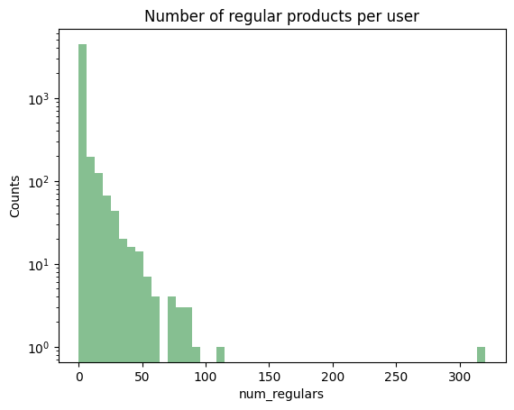
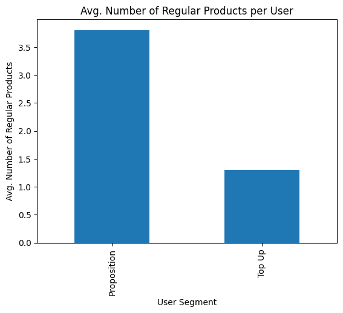
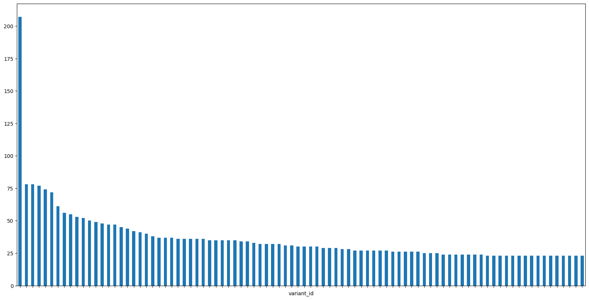
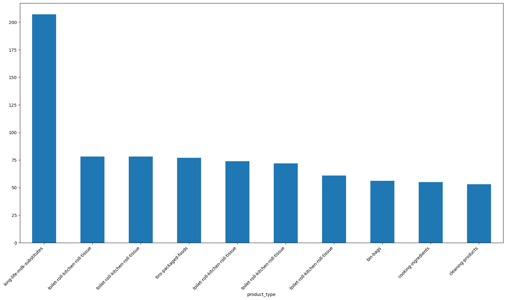
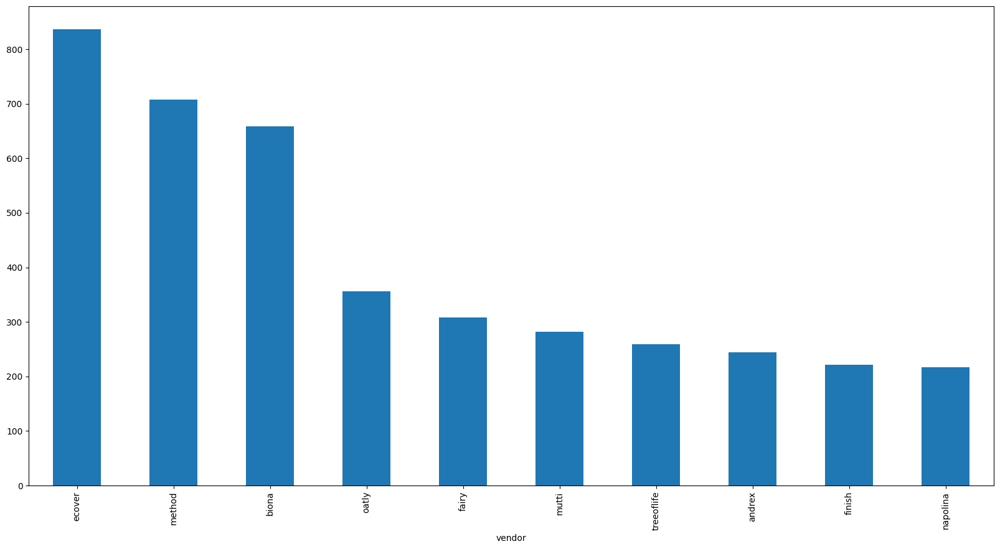
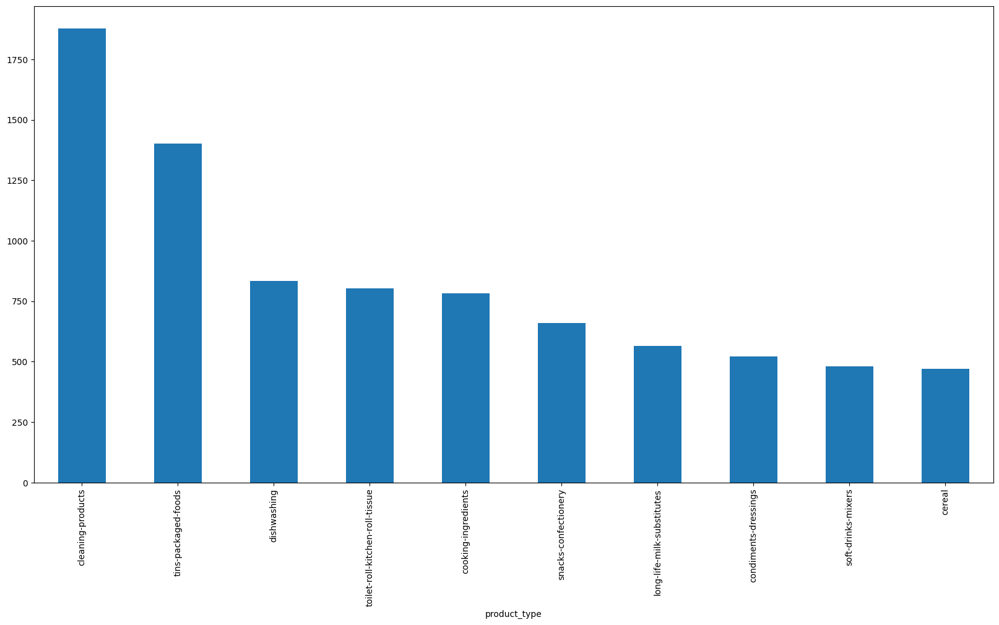
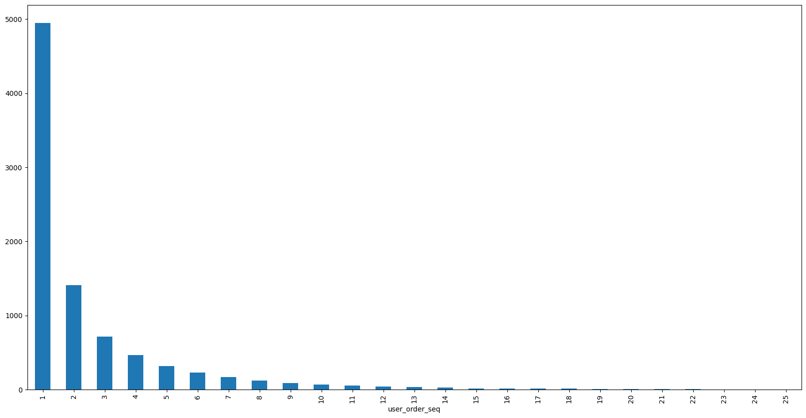
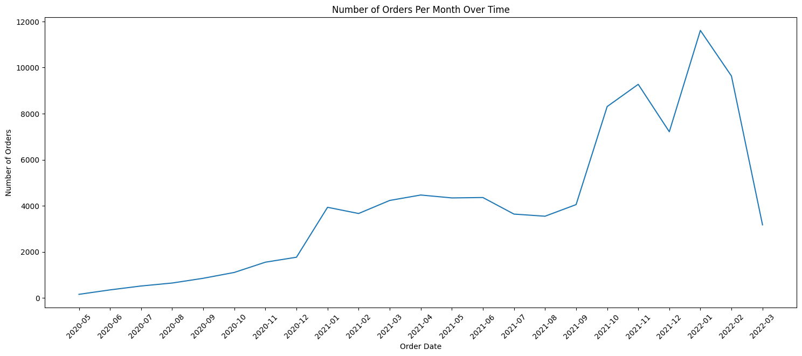
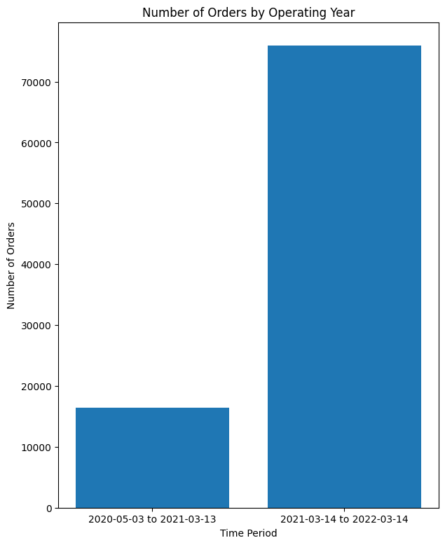
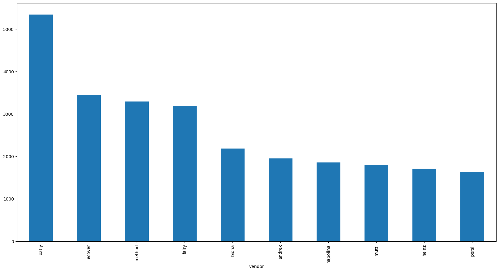

```python
import pandas as pd
import numpy as np
import matplotlib.pyplot as plt
```


```python
def get_null_count(df: pd.DataFrame, name: str) -> pd.DataFrame:
    '''Returns the columns with null values and the number of null values in each column'''
    
    print(f"The dataset {name} has {df.shape[0]} rows and {df.shape[1]} columns\n")
    
    print(f"{df.info()}\n")
    
    count = 0
    for c in df.columns:
        if df[c].isnull().sum() > 0:
            print(f"Column {c} has {df[c].isnull().sum()} null values")
            count += 1
    if count == 0:
        print("No null values found")
    
    display(df.head())
```

# 1. Reading the parquet files

### 1.1. Orders


```python
#Read the dataframes

df_orders = pd.read_parquet('/Users/carlospujades/Documents/Carletes/Myself/Zrive/Module 2/orders.parquet')

get_null_count(df_orders, 'orders')

```

    The dataset orders has 8773 rows and 6 columns
    
    <class 'pandas.core.frame.DataFrame'>
    Index: 8773 entries, 10 to 64538
    Data columns (total 6 columns):
     #   Column          Non-Null Count  Dtype         
    ---  ------          --------------  -----         
     0   id              8773 non-null   int64         
     1   user_id         8773 non-null   object        
     2   created_at      8773 non-null   datetime64[us]
     3   order_date      8773 non-null   datetime64[us]
     4   user_order_seq  8773 non-null   int64         
     5   ordered_items   8773 non-null   object        
    dtypes: datetime64[us](2), int64(2), object(2)
    memory usage: 479.8+ KB
    None
    
    No null values found


<div>
<style scoped>
    .dataframe tbody tr th:only-of-type {
        vertical-align: middle;
    }

    .dataframe tbody tr th {
        vertical-align: top;
    }

    .dataframe thead th {
        text-align: right;
    }
</style>
<table border="1" class="dataframe">
  <thead>
    <tr style="text-align: right;">
      <th></th>
      <th>id</th>
      <th>user_id</th>
      <th>created_at</th>
      <th>order_date</th>
      <th>user_order_seq</th>
      <th>ordered_items</th>
    </tr>
  </thead>
  <tbody>
    <tr>
      <th>10</th>
      <td>2204073066628</td>
      <td>62e271062eb827e411bd73941178d29b022f5f2de9d37f...</td>
      <td>2020-04-30 14:32:19</td>
      <td>2020-04-30</td>
      <td>1</td>
      <td>[33618849693828, 33618860179588, 3361887404045...</td>
    </tr>
    <tr>
      <th>20</th>
      <td>2204707520644</td>
      <td>bf591c887c46d5d3513142b6a855dd7ffb9cc00697f6f5...</td>
      <td>2020-04-30 17:39:00</td>
      <td>2020-04-30</td>
      <td>1</td>
      <td>[33618835243140, 33618835964036, 3361886244058...</td>
    </tr>
    <tr>
      <th>21</th>
      <td>2204838822020</td>
      <td>329f08c66abb51f8c0b8a9526670da2d94c0c6eef06700...</td>
      <td>2020-04-30 18:12:30</td>
      <td>2020-04-30</td>
      <td>1</td>
      <td>[33618891145348, 33618893570180, 3361889766618...</td>
    </tr>
    <tr>
      <th>34</th>
      <td>2208967852164</td>
      <td>f6451fce7b1c58d0effbe37fcb4e67b718193562766470...</td>
      <td>2020-05-01 19:44:11</td>
      <td>2020-05-01</td>
      <td>1</td>
      <td>[33618830196868, 33618846580868, 3361891234624...</td>
    </tr>
    <tr>
      <th>49</th>
      <td>2215889436804</td>
      <td>68e872ff888303bff58ec56a3a986f77ddebdbe5c279e7...</td>
      <td>2020-05-03 21:56:14</td>
      <td>2020-05-03</td>
      <td>1</td>
      <td>[33667166699652, 33667166699652, 3366717122163...</td>
    </tr>
  </tbody>
</table>
</div>


### 1.2. Regulars


```python
df_regulars = pd.read_parquet('/Users/carlospujades/Documents/Carletes/Myself/Zrive/Module 2/regulars.parquet')

get_null_count(df_regulars, 'regulars')

```

    The dataset regulars has 18105 rows and 3 columns
    
    <class 'pandas.core.frame.DataFrame'>
    Index: 18105 entries, 3 to 37720
    Data columns (total 3 columns):
     #   Column      Non-Null Count  Dtype         
    ---  ------      --------------  -----         
     0   user_id     18105 non-null  object        
     1   variant_id  18105 non-null  int64         
     2   created_at  18105 non-null  datetime64[us]
    dtypes: datetime64[us](1), int64(1), object(1)
    memory usage: 565.8+ KB
    None
    
    No null values found


<div>
<style scoped>
    .dataframe tbody tr th:only-of-type {
        vertical-align: middle;
    }

    .dataframe tbody tr th {
        vertical-align: top;
    }

    .dataframe thead th {
        text-align: right;
    }
</style>
<table border="1" class="dataframe">
  <thead>
    <tr style="text-align: right;">
      <th></th>
      <th>user_id</th>
      <th>variant_id</th>
      <th>created_at</th>
    </tr>
  </thead>
  <tbody>
    <tr>
      <th>3</th>
      <td>68e872ff888303bff58ec56a3a986f77ddebdbe5c279e7...</td>
      <td>33618848088196</td>
      <td>2020-04-30 15:07:03</td>
    </tr>
    <tr>
      <th>11</th>
      <td>aed88fc0b004270a62ff1fe4b94141f6b1db1496dbb0c0...</td>
      <td>33667178659972</td>
      <td>2020-05-05 23:34:35</td>
    </tr>
    <tr>
      <th>18</th>
      <td>68e872ff888303bff58ec56a3a986f77ddebdbe5c279e7...</td>
      <td>33619009208452</td>
      <td>2020-04-30 15:07:03</td>
    </tr>
    <tr>
      <th>46</th>
      <td>aed88fc0b004270a62ff1fe4b94141f6b1db1496dbb0c0...</td>
      <td>33667305373828</td>
      <td>2020-05-05 23:34:35</td>
    </tr>
    <tr>
      <th>47</th>
      <td>4594e99557113d5a1c5b59bf31b8704aafe5c7bd180b32...</td>
      <td>33667247341700</td>
      <td>2020-05-06 14:42:11</td>
    </tr>
  </tbody>
</table>
</div>


### 1.3. Abandoned carts


```python
df_abandoned = pd.read_parquet('/Users/carlospujades/Documents/Carletes/Myself/Zrive/Module 2/abandoned_carts.parquet')

get_null_count(df_abandoned, 'abandoned carts')

```

    The dataset abandoned carts has 5457 rows and 4 columns
    
    <class 'pandas.core.frame.DataFrame'>
    Index: 5457 entries, 0 to 70050
    Data columns (total 4 columns):
     #   Column      Non-Null Count  Dtype         
    ---  ------      --------------  -----         
     0   id          5457 non-null   int64         
     1   user_id     5457 non-null   object        
     2   created_at  5457 non-null   datetime64[us]
     3   variant_id  5457 non-null   object        
    dtypes: datetime64[us](1), int64(1), object(2)
    memory usage: 213.2+ KB
    None
    
    No null values found


<div>
<style scoped>
    .dataframe tbody tr th:only-of-type {
        vertical-align: middle;
    }

    .dataframe tbody tr th {
        vertical-align: top;
    }

    .dataframe thead th {
        text-align: right;
    }
</style>
<table border="1" class="dataframe">
  <thead>
    <tr style="text-align: right;">
      <th></th>
      <th>id</th>
      <th>user_id</th>
      <th>created_at</th>
      <th>variant_id</th>
    </tr>
  </thead>
  <tbody>
    <tr>
      <th>0</th>
      <td>12858560217220</td>
      <td>5c4e5953f13ddc3bc9659a3453356155e5efe4739d7a2b...</td>
      <td>2020-05-20 13:53:24</td>
      <td>[33826459287684, 33826457616516, 3366719212762...</td>
    </tr>
    <tr>
      <th>13</th>
      <td>20352449839236</td>
      <td>9d6187545c005d39e44d0456d87790db18611d7c7379bd...</td>
      <td>2021-06-27 05:24:13</td>
      <td>[34415988179076, 34037940158596, 3450282236326...</td>
    </tr>
    <tr>
      <th>45</th>
      <td>20478401413252</td>
      <td>e83fb0273d70c37a2968fee107113698fd4f389c442c0b...</td>
      <td>2021-07-18 08:23:49</td>
      <td>[34543001337988, 34037939372164, 3411360609088...</td>
    </tr>
    <tr>
      <th>50</th>
      <td>20481783103620</td>
      <td>10c42e10e530284b7c7c50f3a23a98726d5747b8128084...</td>
      <td>2021-07-18 21:29:36</td>
      <td>[33667268116612, 34037940224132, 3443605520397...</td>
    </tr>
    <tr>
      <th>52</th>
      <td>20485321687172</td>
      <td>d9989439524b3f6fc4f41686d043f315fb408b954d6153...</td>
      <td>2021-07-19 12:17:05</td>
      <td>[33667268083844, 34284950454404, 33973246886020]</td>
    </tr>
  </tbody>
</table>
</div>


### 1.4. Inventory


```python
df_inventory = pd.read_parquet('/Users/carlospujades/Documents/Carletes/Myself/Zrive/Module 2/inventory.parquet')

get_null_count(df_inventory, 'inventory')

```

    The dataset inventory has 1733 rows and 6 columns
    
    <class 'pandas.core.frame.DataFrame'>
    RangeIndex: 1733 entries, 0 to 1732
    Data columns (total 6 columns):
     #   Column            Non-Null Count  Dtype  
    ---  ------            --------------  -----  
     0   variant_id        1733 non-null   int64  
     1   price             1733 non-null   float64
     2   compare_at_price  1733 non-null   float64
     3   vendor            1733 non-null   object 
     4   product_type      1733 non-null   object 
     5   tags              1733 non-null   object 
    dtypes: float64(2), int64(1), object(3)
    memory usage: 81.4+ KB
    None
    
    No null values found


<div>
<style scoped>
    .dataframe tbody tr th:only-of-type {
        vertical-align: middle;
    }

    .dataframe tbody tr th {
        vertical-align: top;
    }

    .dataframe thead th {
        text-align: right;
    }
</style>
<table border="1" class="dataframe">
  <thead>
    <tr style="text-align: right;">
      <th></th>
      <th>variant_id</th>
      <th>price</th>
      <th>compare_at_price</th>
      <th>vendor</th>
      <th>product_type</th>
      <th>tags</th>
    </tr>
  </thead>
  <tbody>
    <tr>
      <th>0</th>
      <td>39587297165444</td>
      <td>3.09</td>
      <td>3.15</td>
      <td>heinz</td>
      <td>condiments-dressings</td>
      <td>[table-sauces, vegan]</td>
    </tr>
    <tr>
      <th>1</th>
      <td>34370361229444</td>
      <td>4.99</td>
      <td>5.50</td>
      <td>whogivesacrap</td>
      <td>toilet-roll-kitchen-roll-tissue</td>
      <td>[b-corp, eco, toilet-rolls]</td>
    </tr>
    <tr>
      <th>2</th>
      <td>34284951863428</td>
      <td>3.69</td>
      <td>3.99</td>
      <td>plenty</td>
      <td>toilet-roll-kitchen-roll-tissue</td>
      <td>[kitchen-roll]</td>
    </tr>
    <tr>
      <th>3</th>
      <td>33667283583108</td>
      <td>1.79</td>
      <td>1.99</td>
      <td>thecheekypanda</td>
      <td>toilet-roll-kitchen-roll-tissue</td>
      <td>[b-corp, cruelty-free, eco, tissue, vegan]</td>
    </tr>
    <tr>
      <th>4</th>
      <td>33803537973380</td>
      <td>1.99</td>
      <td>2.09</td>
      <td>colgate</td>
      <td>dental</td>
      <td>[dental-accessories]</td>
    </tr>
  </tbody>
</table>
</div>


### 1.5. Users


```python
df_users = pd.read_parquet('/Users/carlospujades/Documents/Carletes/Myself/Zrive/Module 2/users.parquet')

get_null_count(df_users, 'users')
```

    The dataset users has 4983 rows and 10 columns
    
    <class 'pandas.core.frame.DataFrame'>
    Index: 4983 entries, 2160 to 3360
    Data columns (total 10 columns):
     #   Column                 Non-Null Count  Dtype  
    ---  ------                 --------------  -----  
     0   user_id                4983 non-null   object 
     1   user_segment           4983 non-null   object 
     2   user_nuts1             4932 non-null   object 
     3   first_ordered_at       4983 non-null   object 
     4   customer_cohort_month  4983 non-null   object 
     5   count_people           325 non-null    float64
     6   count_adults           325 non-null    float64
     7   count_children         325 non-null    float64
     8   count_babies           325 non-null    float64
     9   count_pets             325 non-null    float64
    dtypes: float64(5), object(5)
    memory usage: 428.2+ KB
    None
    
    Column user_nuts1 has 51 null values
    Column count_people has 4658 null values
    Column count_adults has 4658 null values
    Column count_children has 4658 null values
    Column count_babies has 4658 null values
    Column count_pets has 4658 null values


<div>
<style scoped>
    .dataframe tbody tr th:only-of-type {
        vertical-align: middle;
    }

    .dataframe tbody tr th {
        vertical-align: top;
    }

    .dataframe thead th {
        text-align: right;
    }
</style>
<table border="1" class="dataframe">
  <thead>
    <tr style="text-align: right;">
      <th></th>
      <th>user_id</th>
      <th>user_segment</th>
      <th>user_nuts1</th>
      <th>first_ordered_at</th>
      <th>customer_cohort_month</th>
      <th>count_people</th>
      <th>count_adults</th>
      <th>count_children</th>
      <th>count_babies</th>
      <th>count_pets</th>
    </tr>
  </thead>
  <tbody>
    <tr>
      <th>2160</th>
      <td>0e823a42e107461379e5b5613b7aa00537a72e1b0eaa7a...</td>
      <td>Top Up</td>
      <td>UKH</td>
      <td>2021-05-08 13:33:49</td>
      <td>2021-05-01 00:00:00</td>
      <td>NaN</td>
      <td>NaN</td>
      <td>NaN</td>
      <td>NaN</td>
      <td>NaN</td>
    </tr>
    <tr>
      <th>1123</th>
      <td>15768ced9bed648f745a7aa566a8895f7a73b9a47c1d4f...</td>
      <td>Top Up</td>
      <td>UKJ</td>
      <td>2021-11-17 16:30:20</td>
      <td>2021-11-01 00:00:00</td>
      <td>NaN</td>
      <td>NaN</td>
      <td>NaN</td>
      <td>NaN</td>
      <td>NaN</td>
    </tr>
    <tr>
      <th>1958</th>
      <td>33e0cb6eacea0775e34adbaa2c1dec16b9d6484e6b9324...</td>
      <td>Top Up</td>
      <td>UKD</td>
      <td>2022-03-09 23:12:25</td>
      <td>2022-03-01 00:00:00</td>
      <td>NaN</td>
      <td>NaN</td>
      <td>NaN</td>
      <td>NaN</td>
      <td>NaN</td>
    </tr>
    <tr>
      <th>675</th>
      <td>57ca7591dc79825df0cecc4836a58e6062454555c86c35...</td>
      <td>Top Up</td>
      <td>UKI</td>
      <td>2021-04-23 16:29:02</td>
      <td>2021-04-01 00:00:00</td>
      <td>NaN</td>
      <td>NaN</td>
      <td>NaN</td>
      <td>NaN</td>
      <td>NaN</td>
    </tr>
    <tr>
      <th>4694</th>
      <td>085d8e598139ce6fc9f75d9de97960fa9e1457b409ec00...</td>
      <td>Top Up</td>
      <td>UKJ</td>
      <td>2021-11-02 13:50:06</td>
      <td>2021-11-01 00:00:00</td>
      <td>NaN</td>
      <td>NaN</td>
      <td>NaN</td>
      <td>NaN</td>
      <td>NaN</td>
    </tr>
  </tbody>
</table>
</div>


#### 1.5.1. Exploring the users dataset in depth


```python
df_users_not_null = df_users[df_users['count_people'].notnull()]
df_users_not_null.head()
```


<div>
<style scoped>
    .dataframe tbody tr th:only-of-type {
        vertical-align: middle;
    }

    .dataframe tbody tr th {
        vertical-align: top;
    }

    .dataframe thead th {
        text-align: right;
    }
</style>
<table border="1" class="dataframe">
  <thead>
    <tr style="text-align: right;">
      <th></th>
      <th>user_id</th>
      <th>user_segment</th>
      <th>user_nuts1</th>
      <th>first_ordered_at</th>
      <th>customer_cohort_month</th>
      <th>count_people</th>
      <th>count_adults</th>
      <th>count_children</th>
      <th>count_babies</th>
      <th>count_pets</th>
    </tr>
  </thead>
  <tbody>
    <tr>
      <th>4751</th>
      <td>09d70e0b0778117aec5550c08032d56f8e06f992741680...</td>
      <td>Proposition</td>
      <td>UKI</td>
      <td>2021-06-28 12:07:04</td>
      <td>2021-06-01 00:00:00</td>
      <td>1.0</td>
      <td>1.0</td>
      <td>0.0</td>
      <td>0.0</td>
      <td>0.0</td>
    </tr>
    <tr>
      <th>3154</th>
      <td>4f5ff38ce5ed48096ba80dff80e167db1ad24b9ebdb00c...</td>
      <td>Top Up</td>
      <td>UKD</td>
      <td>2020-06-12 12:07:35</td>
      <td>2020-06-01 00:00:00</td>
      <td>3.0</td>
      <td>2.0</td>
      <td>0.0</td>
      <td>1.0</td>
      <td>0.0</td>
    </tr>
    <tr>
      <th>736</th>
      <td>7b2ae50bb11646436fa613394fc3e71e1a0cdc3ba30cdb...</td>
      <td>Proposition</td>
      <td>UKF</td>
      <td>2020-10-03 09:53:57</td>
      <td>2020-10-01 00:00:00</td>
      <td>2.0</td>
      <td>2.0</td>
      <td>0.0</td>
      <td>0.0</td>
      <td>2.0</td>
    </tr>
    <tr>
      <th>4792</th>
      <td>5e977a4aa2c57f306b8a22f92eaaa177f7dc31a52df82c...</td>
      <td>Proposition</td>
      <td>UKI</td>
      <td>2021-10-14 10:41:13</td>
      <td>2021-10-01 00:00:00</td>
      <td>2.0</td>
      <td>1.0</td>
      <td>1.0</td>
      <td>0.0</td>
      <td>1.0</td>
    </tr>
    <tr>
      <th>2217</th>
      <td>eafb89ad33eb377adb98a915b6a5a65f1284c2db517d07...</td>
      <td>Proposition</td>
      <td>UKH</td>
      <td>2022-01-20 15:53:09</td>
      <td>2022-01-01 00:00:00</td>
      <td>2.0</td>
      <td>2.0</td>
      <td>0.0</td>
      <td>0.0</td>
      <td>0.0</td>
    </tr>
  </tbody>
</table>
</div>


```python
df_users.describe()
```


<div>
<style scoped>
    .dataframe tbody tr th:only-of-type {
        vertical-align: middle;
    }

    .dataframe tbody tr th {
        vertical-align: top;
    }

    .dataframe thead th {
        text-align: right;
    }
</style>
<table border="1" class="dataframe">
  <thead>
    <tr style="text-align: right;">
      <th></th>
      <th>count_people</th>
      <th>count_adults</th>
      <th>count_children</th>
      <th>count_babies</th>
      <th>count_pets</th>
    </tr>
  </thead>
  <tbody>
    <tr>
      <th>count</th>
      <td>325.000000</td>
      <td>325.000000</td>
      <td>325.000000</td>
      <td>325.000000</td>
      <td>325.000000</td>
    </tr>
    <tr>
      <th>mean</th>
      <td>2.787692</td>
      <td>2.003077</td>
      <td>0.707692</td>
      <td>0.076923</td>
      <td>0.636923</td>
    </tr>
    <tr>
      <th>std</th>
      <td>1.365753</td>
      <td>0.869577</td>
      <td>1.026246</td>
      <td>0.289086</td>
      <td>0.995603</td>
    </tr>
    <tr>
      <th>min</th>
      <td>0.000000</td>
      <td>0.000000</td>
      <td>0.000000</td>
      <td>0.000000</td>
      <td>0.000000</td>
    </tr>
    <tr>
      <th>25%</th>
      <td>2.000000</td>
      <td>2.000000</td>
      <td>0.000000</td>
      <td>0.000000</td>
      <td>0.000000</td>
    </tr>
    <tr>
      <th>50%</th>
      <td>3.000000</td>
      <td>2.000000</td>
      <td>0.000000</td>
      <td>0.000000</td>
      <td>0.000000</td>
    </tr>
    <tr>
      <th>75%</th>
      <td>4.000000</td>
      <td>2.000000</td>
      <td>1.000000</td>
      <td>0.000000</td>
      <td>1.000000</td>
    </tr>
    <tr>
      <th>max</th>
      <td>8.000000</td>
      <td>7.000000</td>
      <td>6.000000</td>
      <td>2.000000</td>
      <td>6.000000</td>
    </tr>
  </tbody>
</table>
</div>


```python
df_users['user_nuts1'].value_counts()
```


    user_nuts1
    UKI    1318
    UKJ     745
    UKK     602
    UKH     414
    UKD     358
    UKM     315
    UKE     303
    UKG     295
    UKF     252
    UKL     224
    UKC     102
    UKN       4
    Name: count, dtype: int64


```python
df_users['user_segment'].value_counts()
```


    user_segment
    Top Up         2643
    Proposition    2340
    Name: count, dtype: int64


### 1.6 Conclusions

After reading all the files we get to the conclusion that the only parquet file with null values is the one with users.

Checking the users dataframe we get to the point that the missing values give useful information about the number of children a user has, the number of pets he has or how many people there are in the family.
Due to this is important to replace the missing values with actual values.

We could merge the dataframes of users, orders, regulars and inventory to gather more information about the null values. We have to check if we can cluster the customers based on the products they have purchased, and try and extrapolate the number of "counts" to the customers that have null values on those columns, as they have bought the same products, they may have similar characteristics.

# 2. Joining dataframes

## 2.1. Regulars and users


```python
num_regulars = df_regulars.groupby('user_id')['variant_id'].nunique().reset_index().rename(columns={'variant_id':'num_regulars'})
df_users_orders = df_users.merge(num_regulars, how='left', on='user_id').fillna({'num_regulars':0})
display(df_users_orders.head())
```


<div>
<style scoped>
    .dataframe tbody tr th:only-of-type {
        vertical-align: middle;
    }

    .dataframe tbody tr th {
        vertical-align: top;
    }

    .dataframe thead th {
        text-align: right;
    }
</style>
<table border="1" class="dataframe">
  <thead>
    <tr style="text-align: right;">
      <th></th>
      <th>user_id</th>
      <th>user_segment</th>
      <th>user_nuts1</th>
      <th>first_ordered_at</th>
      <th>customer_cohort_month</th>
      <th>count_people</th>
      <th>count_adults</th>
      <th>count_children</th>
      <th>count_babies</th>
      <th>count_pets</th>
      <th>num_regulars</th>
    </tr>
  </thead>
  <tbody>
    <tr>
      <th>0</th>
      <td>0e823a42e107461379e5b5613b7aa00537a72e1b0eaa7a...</td>
      <td>Top Up</td>
      <td>UKH</td>
      <td>2021-05-08 13:33:49</td>
      <td>2021-05-01 00:00:00</td>
      <td>NaN</td>
      <td>NaN</td>
      <td>NaN</td>
      <td>NaN</td>
      <td>NaN</td>
      <td>0.0</td>
    </tr>
    <tr>
      <th>1</th>
      <td>15768ced9bed648f745a7aa566a8895f7a73b9a47c1d4f...</td>
      <td>Top Up</td>
      <td>UKJ</td>
      <td>2021-11-17 16:30:20</td>
      <td>2021-11-01 00:00:00</td>
      <td>NaN</td>
      <td>NaN</td>
      <td>NaN</td>
      <td>NaN</td>
      <td>NaN</td>
      <td>0.0</td>
    </tr>
    <tr>
      <th>2</th>
      <td>33e0cb6eacea0775e34adbaa2c1dec16b9d6484e6b9324...</td>
      <td>Top Up</td>
      <td>UKD</td>
      <td>2022-03-09 23:12:25</td>
      <td>2022-03-01 00:00:00</td>
      <td>NaN</td>
      <td>NaN</td>
      <td>NaN</td>
      <td>NaN</td>
      <td>NaN</td>
      <td>0.0</td>
    </tr>
    <tr>
      <th>3</th>
      <td>57ca7591dc79825df0cecc4836a58e6062454555c86c35...</td>
      <td>Top Up</td>
      <td>UKI</td>
      <td>2021-04-23 16:29:02</td>
      <td>2021-04-01 00:00:00</td>
      <td>NaN</td>
      <td>NaN</td>
      <td>NaN</td>
      <td>NaN</td>
      <td>NaN</td>
      <td>0.0</td>
    </tr>
    <tr>
      <th>4</th>
      <td>085d8e598139ce6fc9f75d9de97960fa9e1457b409ec00...</td>
      <td>Top Up</td>
      <td>UKJ</td>
      <td>2021-11-02 13:50:06</td>
      <td>2021-11-01 00:00:00</td>
      <td>NaN</td>
      <td>NaN</td>
      <td>NaN</td>
      <td>NaN</td>
      <td>NaN</td>
      <td>0.0</td>
    </tr>
  </tbody>
</table>
</div>


```python
#Let's check the distribution of the number of regular products per user
df_users_orders['num_regulars'].hist(bins=50, grid=False, color='#86bf91', log=True)

plt.title('Number of regular products per user')
plt.xlabel('num_regulars')
plt.ylabel('Counts')
plt.show()
```


    

    


```python
df_users_orders['num_regulars'].describe()
```


    count    4983.000000
    mean        2.481437
    std         8.890588
    min         0.000000
    25%         0.000000
    50%         0.000000
    75%         1.000000
    max       320.000000
    Name: num_regulars, dtype: float64


```python
#Percentage of users with more than 5 regular products
len(df_users_orders[df_users_orders['num_regulars'] > 5])/len(df_users_orders)
```


    0.109773228978527


```python
# Mean number of regular products per user segment
grouped = df_users_orders.groupby('user_segment')['num_regulars'].mean()

grouped.plot(kind='bar')

plt.title('Avg. Number of Regular Products per User')
plt.xlabel('User Segment')
plt.ylabel('Avg. Number of Regular Products')
plt.show()
```


    

    


```python
# Family statistics
num_not_null = df_users_orders['count_people'].notnull().sum()

info  = num_not_null / len(df_users_orders) * 100

num_children = len(df_users_orders[df_users_orders['count_children'] > 0]) / num_not_null * 100
num_babies = len(df_users_orders[df_users_orders['count_babies'] > 0]) / num_not_null * 100
num_pets = len(df_users_orders[df_users_orders['count_pets'] > 0]) / num_not_null * 100

print(f"Percentage of family information: {info}%")

print(f"Percentage of users with children: {num_children}%")
print(f"Percentage of users with babies: {num_babies}%")
print(f"Percentage of users with pets: {num_pets}%")
```

    Percentage of family information: 6.522175396347582%
    Percentage of users with children: 40.0%
    Percentage of users with babies: 7.076923076923077%
    Percentage of users with pets: 40.61538461538461%


### Conclusions

<ol>
<li>Not a lot of users have regular products (~ 90% have less than 5 products)</li>
<li>There are outliers in 'num_regulars' (max. 320 regulars)</li>
<li>Proposition users have more than double the number of regulars than Top Up users</li>
<li>There's a lot of family information missing (only 6.52% available)</li>
<li>From the people that filled out family info, 2 out of every 5 people that buy have children and a pet (40%)</li>
</ol>

## 2.2. Regulars and inventory


```python
df_regulars_inventory = df_regulars.merge(df_inventory, how='left', on='variant_id')
df_regulars_inventory.info()
df_regulars_inventory.head()
```

    <class 'pandas.core.frame.DataFrame'>
    RangeIndex: 18105 entries, 0 to 18104
    Data columns (total 8 columns):
     #   Column            Non-Null Count  Dtype         
    ---  ------            --------------  -----         
     0   user_id           18105 non-null  object        
     1   variant_id        18105 non-null  int64         
     2   created_at        18105 non-null  datetime64[us]
     3   price             15034 non-null  float64       
     4   compare_at_price  15034 non-null  float64       
     5   vendor            15034 non-null  object        
     6   product_type      15034 non-null  object        
     7   tags              15034 non-null  object        
    dtypes: datetime64[us](1), float64(2), int64(1), object(4)
    memory usage: 1.1+ MB


<div>
<style scoped>
    .dataframe tbody tr th:only-of-type {
        vertical-align: middle;
    }

    .dataframe tbody tr th {
        vertical-align: top;
    }

    .dataframe thead th {
        text-align: right;
    }
</style>
<table border="1" class="dataframe">
  <thead>
    <tr style="text-align: right;">
      <th></th>
      <th>user_id</th>
      <th>variant_id</th>
      <th>created_at</th>
      <th>price</th>
      <th>compare_at_price</th>
      <th>vendor</th>
      <th>product_type</th>
      <th>tags</th>
    </tr>
  </thead>
  <tbody>
    <tr>
      <th>0</th>
      <td>68e872ff888303bff58ec56a3a986f77ddebdbe5c279e7...</td>
      <td>33618848088196</td>
      <td>2020-04-30 15:07:03</td>
      <td>NaN</td>
      <td>NaN</td>
      <td>NaN</td>
      <td>NaN</td>
      <td>NaN</td>
    </tr>
    <tr>
      <th>1</th>
      <td>aed88fc0b004270a62ff1fe4b94141f6b1db1496dbb0c0...</td>
      <td>33667178659972</td>
      <td>2020-05-05 23:34:35</td>
      <td>NaN</td>
      <td>NaN</td>
      <td>NaN</td>
      <td>NaN</td>
      <td>NaN</td>
    </tr>
    <tr>
      <th>2</th>
      <td>68e872ff888303bff58ec56a3a986f77ddebdbe5c279e7...</td>
      <td>33619009208452</td>
      <td>2020-04-30 15:07:03</td>
      <td>NaN</td>
      <td>NaN</td>
      <td>NaN</td>
      <td>NaN</td>
      <td>NaN</td>
    </tr>
    <tr>
      <th>3</th>
      <td>aed88fc0b004270a62ff1fe4b94141f6b1db1496dbb0c0...</td>
      <td>33667305373828</td>
      <td>2020-05-05 23:34:35</td>
      <td>NaN</td>
      <td>NaN</td>
      <td>NaN</td>
      <td>NaN</td>
      <td>NaN</td>
    </tr>
    <tr>
      <th>4</th>
      <td>4594e99557113d5a1c5b59bf31b8704aafe5c7bd180b32...</td>
      <td>33667247341700</td>
      <td>2020-05-06 14:42:11</td>
      <td>3.49</td>
      <td>3.5</td>
      <td>method</td>
      <td>cleaning-products</td>
      <td>[cruelty-free, eco, vegan, window-glass-cleaner]</td>
    </tr>
  </tbody>
</table>
</div>


```python
df_regulars_inventory.dropna(subset=['price'], inplace=True)
df_regulars_inventory.info()
```

    <class 'pandas.core.frame.DataFrame'>
    Index: 15034 entries, 4 to 18104
    Data columns (total 8 columns):
     #   Column            Non-Null Count  Dtype         
    ---  ------            --------------  -----         
     0   user_id           15034 non-null  object        
     1   variant_id        15034 non-null  int64         
     2   created_at        15034 non-null  datetime64[us]
     3   price             15034 non-null  float64       
     4   compare_at_price  15034 non-null  float64       
     5   vendor            15034 non-null  object        
     6   product_type      15034 non-null  object        
     7   tags              15034 non-null  object        
    dtypes: datetime64[us](1), float64(2), int64(1), object(4)
    memory usage: 1.0+ MB


```python
#Checking number of regular products bought by user
num_products = df_regulars_inventory.groupby('variant_id')['user_id'].nunique().reset_index().sort_values('user_id', ascending=False).head(90)
ax = num_products.plot(kind='bar', x='variant_id', y='user_id', figsize=(20,10), legend=False)
ax.set_xticklabels([]) 
plt.show()
```


    

    


```python
# Check the product type of the top 10 most popular products
df_product_type = df_regulars_inventory[['variant_id', 'product_type']].drop_duplicates()

num_products = num_products.merge(df_product_type, on='variant_id')

num_products = num_products.head(10)

ax = num_products.plot(kind='bar', x='product_type', y='user_id', figsize=(20,10), legend=False)
ax.set_xticklabels(ax.get_xticklabels(), rotation=45, horizontalalignment='right')
plt.show()


```


    

    


```python
# Check what's the top product sold
top_product = num_products['variant_id'].iloc[0]
df_regulars_inventory[df_regulars_inventory['variant_id'] == top_product].head(1)
```


<div>
<style scoped>
    .dataframe tbody tr th:only-of-type {
        vertical-align: middle;
    }

    .dataframe tbody tr th {
        vertical-align: top;
    }

    .dataframe thead th {
        text-align: right;
    }
</style>
<table border="1" class="dataframe">
  <thead>
    <tr style="text-align: right;">
      <th></th>
      <th>user_id</th>
      <th>variant_id</th>
      <th>created_at</th>
      <th>price</th>
      <th>compare_at_price</th>
      <th>vendor</th>
      <th>product_type</th>
      <th>tags</th>
    </tr>
  </thead>
  <tbody>
    <tr>
      <th>95</th>
      <td>1e49bd8004043d757673793e7d5ea394b4eca7f852b179...</td>
      <td>34081589887108</td>
      <td>2021-01-13 06:12:03</td>
      <td>10.79</td>
      <td>11.94</td>
      <td>oatly</td>
      <td>long-life-milk-substitutes</td>
      <td>[oat-milk, vegan]</td>
    </tr>
  </tbody>
</table>
</div>


```python
# Top 10 vendors
num_vendor = df_regulars_inventory['vendor'].value_counts().head(10)
num_vendor.plot(kind='bar', x=num_vendor.index, y='vendor', figsize=(20,10), legend=False);
```


    

    


```python
# Top 10 product types
num_prod_type = df_regulars_inventory['product_type'].value_counts().head(10)
num_prod_type.plot(kind='bar', x=num_vendor.index, y='vendor', figsize=(20,10), legend=False);
```


    

    


### Conclusions

<ol>
<li>The top product is milk from oatly</li>
<li>The top vendors are eco-friendly brands</li>
<li>The majority of the items sold are in the 'cleaning' category</li>
</ol>

## 2.3. Orders and items


```python
df_orders.head()
```


<div>
<style scoped>
    .dataframe tbody tr th:only-of-type {
        vertical-align: middle;
    }

    .dataframe tbody tr th {
        vertical-align: top;
    }

    .dataframe thead th {
        text-align: right;
    }
</style>
<table border="1" class="dataframe">
  <thead>
    <tr style="text-align: right;">
      <th></th>
      <th>id</th>
      <th>user_id</th>
      <th>created_at</th>
      <th>order_date</th>
      <th>user_order_seq</th>
      <th>ordered_items</th>
    </tr>
  </thead>
  <tbody>
    <tr>
      <th>10</th>
      <td>2204073066628</td>
      <td>62e271062eb827e411bd73941178d29b022f5f2de9d37f...</td>
      <td>2020-04-30 14:32:19</td>
      <td>2020-04-30</td>
      <td>1</td>
      <td>[33618849693828, 33618860179588, 3361887404045...</td>
    </tr>
    <tr>
      <th>20</th>
      <td>2204707520644</td>
      <td>bf591c887c46d5d3513142b6a855dd7ffb9cc00697f6f5...</td>
      <td>2020-04-30 17:39:00</td>
      <td>2020-04-30</td>
      <td>1</td>
      <td>[33618835243140, 33618835964036, 3361886244058...</td>
    </tr>
    <tr>
      <th>21</th>
      <td>2204838822020</td>
      <td>329f08c66abb51f8c0b8a9526670da2d94c0c6eef06700...</td>
      <td>2020-04-30 18:12:30</td>
      <td>2020-04-30</td>
      <td>1</td>
      <td>[33618891145348, 33618893570180, 3361889766618...</td>
    </tr>
    <tr>
      <th>34</th>
      <td>2208967852164</td>
      <td>f6451fce7b1c58d0effbe37fcb4e67b718193562766470...</td>
      <td>2020-05-01 19:44:11</td>
      <td>2020-05-01</td>
      <td>1</td>
      <td>[33618830196868, 33618846580868, 3361891234624...</td>
    </tr>
    <tr>
      <th>49</th>
      <td>2215889436804</td>
      <td>68e872ff888303bff58ec56a3a986f77ddebdbe5c279e7...</td>
      <td>2020-05-03 21:56:14</td>
      <td>2020-05-03</td>
      <td>1</td>
      <td>[33667166699652, 33667166699652, 3366717122163...</td>
    </tr>
  </tbody>
</table>
</div>


```python
df_orders = df_orders.explode('ordered_items').rename(columns={'ordered_items':'variant_id'})
```


```python
df_orders_items = df_orders.merge(df_inventory, how='left', on='variant_id')
```


```python
df_orders_items.dropna(inplace=True)
```


```python
df_orders_items.head()
```


<div>
<style scoped>
    .dataframe tbody tr th:only-of-type {
        vertical-align: middle;
    }

    .dataframe tbody tr th {
        vertical-align: top;
    }

    .dataframe thead th {
        text-align: right;
    }
</style>
<table border="1" class="dataframe">
  <thead>
    <tr style="text-align: right;">
      <th></th>
      <th>id</th>
      <th>user_id</th>
      <th>created_at</th>
      <th>order_date</th>
      <th>user_order_seq</th>
      <th>variant_id</th>
      <th>price</th>
      <th>compare_at_price</th>
      <th>vendor</th>
      <th>product_type</th>
      <th>tags</th>
    </tr>
  </thead>
  <tbody>
    <tr>
      <th>70</th>
      <td>2215889436804</td>
      <td>68e872ff888303bff58ec56a3a986f77ddebdbe5c279e7...</td>
      <td>2020-05-03 21:56:14</td>
      <td>2020-05-03</td>
      <td>1</td>
      <td>33667238658180</td>
      <td>4.19</td>
      <td>5.10</td>
      <td>listerine</td>
      <td>dental</td>
      <td>[mouthwash]</td>
    </tr>
    <tr>
      <th>71</th>
      <td>2215889436804</td>
      <td>68e872ff888303bff58ec56a3a986f77ddebdbe5c279e7...</td>
      <td>2020-05-03 21:56:14</td>
      <td>2020-05-03</td>
      <td>1</td>
      <td>33667238658180</td>
      <td>4.19</td>
      <td>5.10</td>
      <td>listerine</td>
      <td>dental</td>
      <td>[mouthwash]</td>
    </tr>
    <tr>
      <th>76</th>
      <td>2217346236548</td>
      <td>66a7b6a77952abc3ef3246da56fb148814704a3c2b420c...</td>
      <td>2020-05-04 11:25:26</td>
      <td>2020-05-04</td>
      <td>1</td>
      <td>33667206054020</td>
      <td>17.99</td>
      <td>20.65</td>
      <td>ecover</td>
      <td>delicates-stain-remover</td>
      <td>[cruelty-free, delicates-stain-remover, eco, v...</td>
    </tr>
    <tr>
      <th>77</th>
      <td>2217346236548</td>
      <td>66a7b6a77952abc3ef3246da56fb148814704a3c2b420c...</td>
      <td>2020-05-04 11:25:26</td>
      <td>2020-05-04</td>
      <td>1</td>
      <td>33667206283396</td>
      <td>9.99</td>
      <td>12.00</td>
      <td>ecover</td>
      <td>fabric-softener-freshener</td>
      <td>[cruelty-free, eco, fabric-softener-freshener,...</td>
    </tr>
    <tr>
      <th>81</th>
      <td>2217346236548</td>
      <td>66a7b6a77952abc3ef3246da56fb148814704a3c2b420c...</td>
      <td>2020-05-04 11:25:26</td>
      <td>2020-05-04</td>
      <td>1</td>
      <td>39459277602948</td>
      <td>5.79</td>
      <td>5.98</td>
      <td>ecloth</td>
      <td>cleaning-products</td>
      <td>[eco, sponges-cloths-gloves]</td>
    </tr>
  </tbody>
</table>
</div>


```python
#Number of orders per user
num_orders = df_orders_items.groupby('user_order_seq')['user_id'].nunique().reset_index().sort_values('user_id', ascending=False)
num_orders.plot(kind='bar', x='user_order_seq', y='user_id', figsize=(20,10), legend=False);
```


    

    


```python
repeating_customers = round(num_orders[num_orders['user_order_seq'] > 1]['user_id'].sum() / num_orders['user_id'].sum() * 100, 2)
print(f"There's a {repeating_customers}% of repeating customers")
```

    There's a 43.34% of repeating customers


```python
df_orders_items['year_month'] = df_orders_items['order_date'].dt.strftime('%Y-%m')
```


```python
total_price_per_order = df_orders_items.groupby(['id'])['price'].sum().reset_index().sort_values('price', ascending=False).head(10)
total_price_per_order
```


<div>
<style scoped>
    .dataframe tbody tr th:only-of-type {
        vertical-align: middle;
    }

    .dataframe tbody tr th {
        vertical-align: top;
    }

    .dataframe thead th {
        text-align: right;
    }
</style>
<table border="1" class="dataframe">
  <thead>
    <tr style="text-align: right;">
      <th></th>
      <th>id</th>
      <th>price</th>
    </tr>
  </thead>
  <tbody>
    <tr>
      <th>8181</th>
      <td>4006197395588</td>
      <td>319.80</td>
    </tr>
    <tr>
      <th>3341</th>
      <td>3771446362244</td>
      <td>319.80</td>
    </tr>
    <tr>
      <th>3148</th>
      <td>3755775033476</td>
      <td>319.80</td>
    </tr>
    <tr>
      <th>1697</th>
      <td>3655034110084</td>
      <td>319.80</td>
    </tr>
    <tr>
      <th>8550</th>
      <td>4017842126980</td>
      <td>296.67</td>
    </tr>
    <tr>
      <th>7968</th>
      <td>3995160215684</td>
      <td>271.89</td>
    </tr>
    <tr>
      <th>2963</th>
      <td>3742133715076</td>
      <td>259.80</td>
    </tr>
    <tr>
      <th>2440</th>
      <td>3706182467716</td>
      <td>256.47</td>
    </tr>
    <tr>
      <th>4145</th>
      <td>3837636116612</td>
      <td>255.84</td>
    </tr>
    <tr>
      <th>3113</th>
      <td>3752334098564</td>
      <td>253.18</td>
    </tr>
  </tbody>
</table>
</div>


```python
avg_price_per_order = round(total_price_per_order['price'].mean(), 2)
print(f"The average price per order is {avg_price_per_order}")
```

    The average price per order is 287.3


```python
#Evolution of number of orders per month
orders_over_time = df_orders_items['year_month'].value_counts().sort_index()

plt.figure(figsize=(18,7))
plt.plot(orders_over_time.index, orders_over_time.values)
plt.xlabel('Order Date')
plt.ylabel('Number of Orders')
plt.title('Number of Orders Per Month Over Time')
plt.xticks(rotation=45)
plt.grid(False)
plt.show()
```


    

    


```python
(df_orders_items['order_date'].min(), df_orders_items['order_date'].max())
```


    (Timestamp('2020-05-03 00:00:00'), Timestamp('2022-03-14 00:00:00'))


```python
#Comparing number of orders per operating year
start_date1 = '2020-05-03'
end_date1 = '2021-03-13'
start_date2 = '2021-03-14'
end_date2 = '2022-03-14'

df1 = df_orders_items[(df_orders_items['order_date'] >= start_date1) & (df_orders_items['order_date'] <= end_date1)]
df2 = df_orders_items[(df_orders_items['order_date'] >= start_date2) & (df_orders_items['order_date'] <= end_date2)]

num_orders1 = df1['order_date'].count()
num_orders2 = df2['order_date'].count()

plt.figure(figsize=(7,9))
plt.bar(['2020-05-03 to 2021-03-13', '2021-03-14 to 2022-03-14'], [num_orders1, num_orders2])
plt.xlabel('Time Period')
plt.ylabel('Number of Orders')
plt.title('Number of Orders by Operating Year')
plt.show()
```


    

    


```python
#Top 10 vendors
top_10_vendors = df_orders_items['vendor'].value_counts().head(10)
top_10_vendors.plot(kind='bar', x=top_10_vendors.index, y='vendor', figsize=(20,10), legend=False);
```


    

    


### Conclusions

<ol>
<li>Almost half of our customers are repeating customers (43.34%)</li>
<li>The average price per order is 287.30</li>
<li>The number of orders has grown over time (as well as the revenue)</li>
<li>The number of orders in our second operating year almost quadruples the number of orders on our first year</li>
<li>The most bought product is from oatly</li>
</ol>
