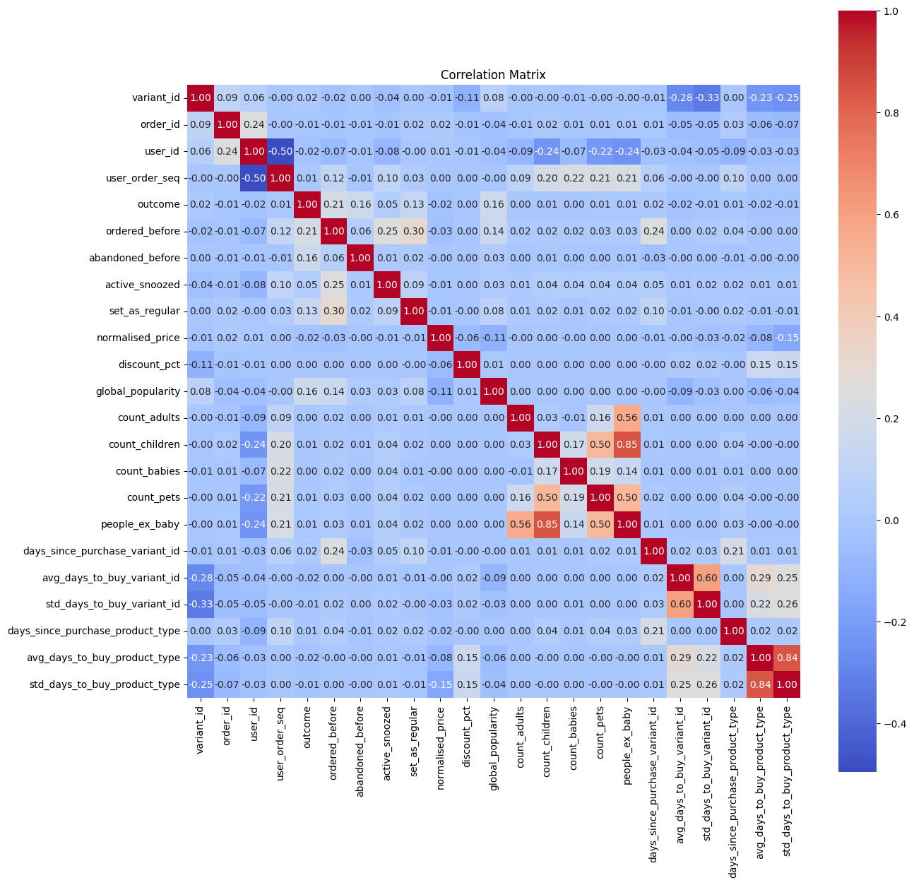

```python
import pandas as pd
import numpy as np
import matplotlib.pyplot as plt
import seaborn as sns
```


```python
df = pd.read_csv('/Users/carlospujades/Documents/Carletes/Myself/Zrive/Module 2/feature_frame.csv')
df.info()
df.head()
```

    <class 'pandas.core.frame.DataFrame'>
    RangeIndex: 2880549 entries, 0 to 2880548
    Data columns (total 27 columns):
     #   Column                            Dtype  
    ---  ------                            -----  
     0   variant_id                        int64  
     1   product_type                      object 
     2   order_id                          int64  
     3   user_id                           int64  
     4   created_at                        object 
     5   order_date                        object 
     6   user_order_seq                    int64  
     7   outcome                           float64
     8   ordered_before                    float64
     9   abandoned_before                  float64
     10  active_snoozed                    float64
     11  set_as_regular                    float64
     12  normalised_price                  float64
     13  discount_pct                      float64
     14  vendor                            object 
     15  global_popularity                 float64
     16  count_adults                      float64
     17  count_children                    float64
     18  count_babies                      float64
     19  count_pets                        float64
     20  people_ex_baby                    float64
     21  days_since_purchase_variant_id    float64
     22  avg_days_to_buy_variant_id        float64
     23  std_days_to_buy_variant_id        float64
     24  days_since_purchase_product_type  float64
     25  avg_days_to_buy_product_type      float64
     26  std_days_to_buy_product_type      float64
    dtypes: float64(19), int64(4), object(4)
    memory usage: 593.4+ MB


<div>
<style scoped>
    .dataframe tbody tr th:only-of-type {
        vertical-align: middle;
    }

    .dataframe tbody tr th {
        vertical-align: top;
    }

    .dataframe thead th {
        text-align: right;
    }
</style>
<table border="1" class="dataframe">
  <thead>
    <tr style="text-align: right;">
      <th></th>
      <th>variant_id</th>
      <th>product_type</th>
      <th>order_id</th>
      <th>user_id</th>
      <th>created_at</th>
      <th>order_date</th>
      <th>user_order_seq</th>
      <th>outcome</th>
      <th>ordered_before</th>
      <th>abandoned_before</th>
      <th>...</th>
      <th>count_children</th>
      <th>count_babies</th>
      <th>count_pets</th>
      <th>people_ex_baby</th>
      <th>days_since_purchase_variant_id</th>
      <th>avg_days_to_buy_variant_id</th>
      <th>std_days_to_buy_variant_id</th>
      <th>days_since_purchase_product_type</th>
      <th>avg_days_to_buy_product_type</th>
      <th>std_days_to_buy_product_type</th>
    </tr>
  </thead>
  <tbody>
    <tr>
      <th>0</th>
      <td>33826472919172</td>
      <td>ricepastapulses</td>
      <td>2807985930372</td>
      <td>3482464092292</td>
      <td>2020-10-05 16:46:19</td>
      <td>2020-10-05 00:00:00</td>
      <td>3</td>
      <td>0.00</td>
      <td>0.00</td>
      <td>0.00</td>
      <td>...</td>
      <td>0.00</td>
      <td>0.00</td>
      <td>0.00</td>
      <td>2.00</td>
      <td>33.00</td>
      <td>42.00</td>
      <td>31.13</td>
      <td>30.00</td>
      <td>30.00</td>
      <td>24.28</td>
    </tr>
    <tr>
      <th>1</th>
      <td>33826472919172</td>
      <td>ricepastapulses</td>
      <td>2808027644036</td>
      <td>3466586718340</td>
      <td>2020-10-05 17:59:51</td>
      <td>2020-10-05 00:00:00</td>
      <td>2</td>
      <td>0.00</td>
      <td>0.00</td>
      <td>0.00</td>
      <td>...</td>
      <td>0.00</td>
      <td>0.00</td>
      <td>0.00</td>
      <td>2.00</td>
      <td>33.00</td>
      <td>42.00</td>
      <td>31.13</td>
      <td>30.00</td>
      <td>30.00</td>
      <td>24.28</td>
    </tr>
    <tr>
      <th>2</th>
      <td>33826472919172</td>
      <td>ricepastapulses</td>
      <td>2808099078276</td>
      <td>3481384026244</td>
      <td>2020-10-05 20:08:53</td>
      <td>2020-10-05 00:00:00</td>
      <td>4</td>
      <td>0.00</td>
      <td>0.00</td>
      <td>0.00</td>
      <td>...</td>
      <td>0.00</td>
      <td>0.00</td>
      <td>0.00</td>
      <td>2.00</td>
      <td>33.00</td>
      <td>42.00</td>
      <td>31.13</td>
      <td>30.00</td>
      <td>30.00</td>
      <td>24.28</td>
    </tr>
    <tr>
      <th>3</th>
      <td>33826472919172</td>
      <td>ricepastapulses</td>
      <td>2808393957508</td>
      <td>3291363377284</td>
      <td>2020-10-06 08:57:59</td>
      <td>2020-10-06 00:00:00</td>
      <td>2</td>
      <td>0.00</td>
      <td>0.00</td>
      <td>0.00</td>
      <td>...</td>
      <td>0.00</td>
      <td>0.00</td>
      <td>0.00</td>
      <td>2.00</td>
      <td>33.00</td>
      <td>42.00</td>
      <td>31.13</td>
      <td>30.00</td>
      <td>30.00</td>
      <td>24.28</td>
    </tr>
    <tr>
      <th>4</th>
      <td>33826472919172</td>
      <td>ricepastapulses</td>
      <td>2808429314180</td>
      <td>3537167515780</td>
      <td>2020-10-06 10:37:05</td>
      <td>2020-10-06 00:00:00</td>
      <td>3</td>
      <td>0.00</td>
      <td>0.00</td>
      <td>0.00</td>
      <td>...</td>
      <td>0.00</td>
      <td>0.00</td>
      <td>0.00</td>
      <td>2.00</td>
      <td>33.00</td>
      <td>42.00</td>
      <td>31.13</td>
      <td>30.00</td>
      <td>30.00</td>
      <td>24.28</td>
    </tr>
  </tbody>
</table>
<p>5 rows × 27 columns</p>
</div>


```python
df.isnull().sum()
```


    variant_id                          0
    product_type                        0
    order_id                            0
    user_id                             0
    created_at                          0
    order_date                          0
    user_order_seq                      0
    outcome                             0
    ordered_before                      0
    abandoned_before                    0
    active_snoozed                      0
    set_as_regular                      0
    normalised_price                    0
    discount_pct                        0
    vendor                              0
    global_popularity                   0
    count_adults                        0
    count_children                      0
    count_babies                        0
    count_pets                          0
    people_ex_baby                      0
    days_since_purchase_variant_id      0
    avg_days_to_buy_variant_id          0
    std_days_to_buy_variant_id          0
    days_since_purchase_product_type    0
    avg_days_to_buy_product_type        0
    std_days_to_buy_product_type        0
    dtype: int64


```python
df.columns
```


    Index(['variant_id', 'product_type', 'order_id', 'user_id', 'created_at',
           'order_date', 'user_order_seq', 'outcome', 'ordered_before',
           'abandoned_before', 'active_snoozed', 'set_as_regular',
           'normalised_price', 'discount_pct', 'vendor', 'global_popularity',
           'count_adults', 'count_children', 'count_babies', 'count_pets',
           'people_ex_baby', 'days_since_purchase_variant_id',
           'avg_days_to_buy_variant_id', 'std_days_to_buy_variant_id',
           'days_since_purchase_product_type', 'avg_days_to_buy_product_type',
           'std_days_to_buy_product_type'],
          dtype='object')


```python
#Categorical columns describe
df[['product_type', 'vendor']].describe()
```


<div>
<style scoped>
    .dataframe tbody tr th:only-of-type {
        vertical-align: middle;
    }

    .dataframe tbody tr th {
        vertical-align: top;
    }

    .dataframe thead th {
        text-align: right;
    }
</style>
<table border="1" class="dataframe">
  <thead>
    <tr style="text-align: right;">
      <th></th>
      <th>product_type</th>
      <th>vendor</th>
    </tr>
  </thead>
  <tbody>
    <tr>
      <th>count</th>
      <td>2880549</td>
      <td>2880549</td>
    </tr>
    <tr>
      <th>unique</th>
      <td>62</td>
      <td>264</td>
    </tr>
    <tr>
      <th>top</th>
      <td>tinspackagedfoods</td>
      <td>biona</td>
    </tr>
    <tr>
      <th>freq</th>
      <td>226474</td>
      <td>146828</td>
    </tr>
  </tbody>
</table>
</div>


```python
pd.set_option('display.float_format', lambda x: '%.2f' % x)
```


```python
#Family columns describe
df[['count_adults', 'count_children', 'count_babies', 'count_pets']].describe()
```


<div>
<style scoped>
    .dataframe tbody tr th:only-of-type {
        vertical-align: middle;
    }

    .dataframe tbody tr th {
        vertical-align: top;
    }

    .dataframe thead th {
        text-align: right;
    }
</style>
<table border="1" class="dataframe">
  <thead>
    <tr style="text-align: right;">
      <th></th>
      <th>count_adults</th>
      <th>count_children</th>
      <th>count_babies</th>
      <th>count_pets</th>
    </tr>
  </thead>
  <tbody>
    <tr>
      <th>count</th>
      <td>2880549.00</td>
      <td>2880549.00</td>
      <td>2880549.00</td>
      <td>2880549.00</td>
    </tr>
    <tr>
      <th>mean</th>
      <td>2.02</td>
      <td>0.05</td>
      <td>0.00</td>
      <td>0.05</td>
    </tr>
    <tr>
      <th>std</th>
      <td>0.21</td>
      <td>0.33</td>
      <td>0.06</td>
      <td>0.30</td>
    </tr>
    <tr>
      <th>min</th>
      <td>1.00</td>
      <td>0.00</td>
      <td>0.00</td>
      <td>0.00</td>
    </tr>
    <tr>
      <th>25%</th>
      <td>2.00</td>
      <td>0.00</td>
      <td>0.00</td>
      <td>0.00</td>
    </tr>
    <tr>
      <th>50%</th>
      <td>2.00</td>
      <td>0.00</td>
      <td>0.00</td>
      <td>0.00</td>
    </tr>
    <tr>
      <th>75%</th>
      <td>2.00</td>
      <td>0.00</td>
      <td>0.00</td>
      <td>0.00</td>
    </tr>
    <tr>
      <th>max</th>
      <td>5.00</td>
      <td>3.00</td>
      <td>1.00</td>
      <td>6.00</td>
    </tr>
  </tbody>
</table>
</div>


```python
#Purchase columns describe
df[['days_since_purchase_variant_id', 'avg_days_to_buy_variant_id', 'std_days_to_buy_variant_id', 'days_since_purchase_product_type', 'avg_days_to_buy_product_type','std_days_to_buy_product_type']].describe()
```


<div>
<style scoped>
    .dataframe tbody tr th:only-of-type {
        vertical-align: middle;
    }

    .dataframe tbody tr th {
        vertical-align: top;
    }

    .dataframe thead th {
        text-align: right;
    }
</style>
<table border="1" class="dataframe">
  <thead>
    <tr style="text-align: right;">
      <th></th>
      <th>days_since_purchase_variant_id</th>
      <th>avg_days_to_buy_variant_id</th>
      <th>std_days_to_buy_variant_id</th>
      <th>days_since_purchase_product_type</th>
      <th>avg_days_to_buy_product_type</th>
      <th>std_days_to_buy_product_type</th>
    </tr>
  </thead>
  <tbody>
    <tr>
      <th>count</th>
      <td>2880549.00</td>
      <td>2880549.00</td>
      <td>2880549.00</td>
      <td>2880549.00</td>
      <td>2880549.00</td>
      <td>2880549.00</td>
    </tr>
    <tr>
      <th>mean</th>
      <td>33.13</td>
      <td>35.24</td>
      <td>26.45</td>
      <td>31.44</td>
      <td>30.89</td>
      <td>25.95</td>
    </tr>
    <tr>
      <th>std</th>
      <td>3.71</td>
      <td>10.58</td>
      <td>7.17</td>
      <td>12.28</td>
      <td>4.33</td>
      <td>3.28</td>
    </tr>
    <tr>
      <th>min</th>
      <td>0.00</td>
      <td>0.00</td>
      <td>1.41</td>
      <td>0.00</td>
      <td>7.00</td>
      <td>2.83</td>
    </tr>
    <tr>
      <th>25%</th>
      <td>33.00</td>
      <td>30.00</td>
      <td>23.19</td>
      <td>30.00</td>
      <td>28.00</td>
      <td>24.28</td>
    </tr>
    <tr>
      <th>50%</th>
      <td>33.00</td>
      <td>34.00</td>
      <td>27.69</td>
      <td>30.00</td>
      <td>31.00</td>
      <td>26.08</td>
    </tr>
    <tr>
      <th>75%</th>
      <td>33.00</td>
      <td>40.00</td>
      <td>30.59</td>
      <td>30.00</td>
      <td>34.00</td>
      <td>27.96</td>
    </tr>
    <tr>
      <th>max</th>
      <td>148.00</td>
      <td>84.00</td>
      <td>58.69</td>
      <td>148.00</td>
      <td>39.50</td>
      <td>35.64</td>
    </tr>
  </tbody>
</table>
</div>


```python
#Outcome column
df['outcome'].value_counts().reset_index()
```


<div>
<style scoped>
    .dataframe tbody tr th:only-of-type {
        vertical-align: middle;
    }

    .dataframe tbody tr th {
        vertical-align: top;
    }

    .dataframe thead th {
        text-align: right;
    }
</style>
<table border="1" class="dataframe">
  <thead>
    <tr style="text-align: right;">
      <th></th>
      <th>outcome</th>
      <th>count</th>
    </tr>
  </thead>
  <tbody>
    <tr>
      <th>0</th>
      <td>0.00</td>
      <td>2847317</td>
    </tr>
    <tr>
      <th>1</th>
      <td>1.00</td>
      <td>33232</td>
    </tr>
  </tbody>
</table>
</div>


```python
boolean_columns = ['ordered_before', 'abandoned_before', 'active_snoozed', 'set_as_regular']

for col in boolean_columns:
    outcome_mean = df.groupby(col)['outcome'].mean()
    value_counts = df[col].value_counts()
    result = pd.concat([outcome_mean, value_counts], axis=1, keys=['Outcome Mean', 'Value Counts'])
    print(result)
```

                    Outcome Mean  Value Counts
    ordered_before                            
    0.00                    0.01       2819658
    1.00                    0.16         60891
                      Outcome Mean  Value Counts
    abandoned_before                            
    0.00                      0.01       2878794
    1.00                      0.72          1755
                    Outcome Mean  Value Counts
    active_snoozed                            
    0.00                    0.01       2873952
    1.00                    0.11          6597
                    Outcome Mean  Value Counts
    set_as_regular                            
    0.00                    0.01       2870093
    1.00                    0.25         10456


```python
#Correlation matrix
df_corr = df.drop(['product_type', 'vendor', 'created_at', 'order_date'], axis=1)
corr = df_corr.corr()

plt.figure(figsize=(14, 14))
sns.heatmap(corr, annot=True, fmt=".2f", cmap='coolwarm', cbar=True, square=True)
plt.title('Correlation Matrix')
plt.show()
```


    

    

